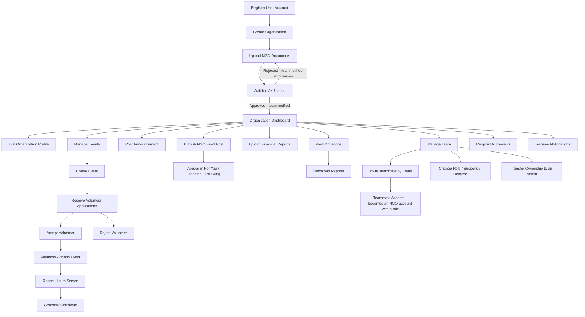

# Organisation flow

The path an NGO takes from a signup to publishing. Mirrors the superadmin
verification workflow described in `AGENTS.md` → "Current state".

```mermaid
flowchart TD
    A[Register User Account] --> B[Create Organization]
    B --> C[Upload NGO Documents]
    C --> D[Wait for Verification]
    D -->|Approved - team notified| E[Organization Dashboard]
    D -->|Rejected - team notified with reason| C
    E --> F[Edit Organization Profile]
    E --> G[Manage Events]
    G --> H[Create Event]
    H --> I[Receive Volunteer Applications]
    I --> J[Accept Volunteer]
    I --> K[Reject Volunteer]
    J --> L[Volunteer Attends Event]
    L --> L2[Record Hours Served]
    L2 --> M[Generate Certificate]
    E --> N[Post Announcement]
    E --> U[Publish NGO Feed Post]
    U --> V[Appear in For You / Trending / Following]
    E --> O[Upload Financial Reports]
    E --> P[View Donations]
    P --> Q[Download Reports]
    E --> R[Manage Team]
    R --> R1[Invite Teammate by Email]
    R1 --> R2[Teammate Accepts - becomes an NGO account with a role]
    R --> R3[Change Role / Suspend / Remove]
    R --> R4[Transfer Ownership to an Admin]
    E --> S[Respond to Reviews]
    E --> T[Receive Notifications]
```
