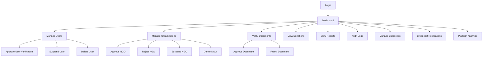

# Superadmin flow

The moderation and verification surface. Mirrors the "superadmin" role
described in `AGENTS.md` → Roles.

```mermaid
flowchart TD
    A[Login] --> B[Dashboard]
    B --> C[Manage Users]
    C --> D[Approve User Verification]
    C --> E[Suspend User]
    C --> F[Delete User]
    B --> G[Manage Organizations]
    G --> H[Approve NGO]
    G --> I[Reject NGO]
    G --> J[Suspend NGO]
    G --> K[Delete NGO]
    B --> L[Verify Documents]
    L --> M[Approve Document]
    L --> N[Reject Document]
    B --> O[View Donations]
    B --> P[View Reports]
    B --> Q[Audit Logs]
    B --> R[Manage Categories]
    B --> S[Broadcast Notifications]
    B --> T[Platform Analytics]
```
