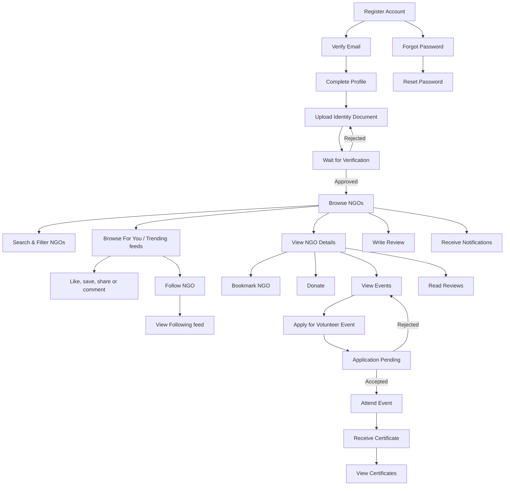

# Volunteer flow

The path a volunteer takes from signup to collecting a certificate. Mirrors the
"volunteer" role described in `AGENTS.md` → Roles.

```mermaid
flowchart TD
    A[Register Account] --> B[Verify Email]
    B --> C[Complete Profile]
    C --> D[Upload Identity Document]
    D --> E[Wait for Verification]
    E -->|Approved| F[Browse NGOs]
    E -->|Rejected| D
    F --> G[Search & Filter NGOs]
    F --> V[Browse For You / Trending feeds]
    V --> W[Like, save, share or comment]
    V --> X[Follow NGO]
    X --> Y[View Following feed]
    F --> H[View NGO Details]
    H --> I[Bookmark NGO]
    H --> J[Donate]
    H --> K[View Events]
    H --> L[Read Reviews]
    K --> M[Apply for Volunteer Event]
    M --> N[Application Pending]
    N -->|Accepted| O[Attend Event]
    N -->|Rejected| K
    O --> P[Receive Certificate]
    F --> Q[Write Review]
    P --> R[View Certificates]
    A --> S[Forgot Password]
    S --> T[Reset Password]
    F --> U[Receive Notifications]
```
